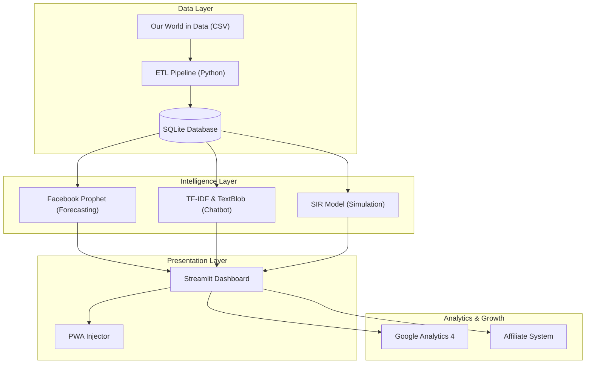

# 🚀 COVID-19 Vaccine Tracker: A Full-Stack AI & Data Engineering Case Study

**Developer**: Manish Sau
**Live Demo**: [covid-vaccine-tracker-2025.streamlit.app](https://covid-vaccine-tracker-2025.streamlit.app/)
**Tech Stack**: Python, Streamlit, SQLite, Facebook Prophet, Plotly, Google Analytics 4

---

## 1. Project Vision & Architecture

### The Goal

To build a **democratized, accessible, and intelligent** public health platform that goes beyond simple charts. The goal was to combine real-time data tracking with AI-powered insights and predictive modeling, accessible to anyone, anywhere (PWA).

### High-Level Architecture

The system follows a modular **Data-Centric Architecture**:



---

## 2. Development Journey: From Scratch to Production

### Phase 1: The Foundation (Data Engineering)

**Challenge**: Handling massive, messy daily vaccination datasets.
**Solution**:

- Built a robust **ETL Pipeline** (`src/etl.py`) using Pandas.
- Implemented data cleaning, normalization, and imputation strategies.
- Chose **SQLite** for a serverless, zero-config database that lives with the code, ensuring fast local queries without external dependencies.

### Phase 2: Core Visualization & Dashboard

**Challenge**: Creating interactive, responsive charts in Python without writing complex JavaScript.
**Solution**:

- Leveraged **Streamlit** for rapid UI development.
- Integrated **Plotly Express** for interactive time-series charts and choropleth maps.
- Implemented a **Country Face-Off** tool for head-to-head metric comparison.

### Phase 3: Artificial Intelligence Integration

**Challenge**: Making data "speak" to non-technical users.
**Solution**:

- **Forecasting**: Integrated **Facebook Prophet** to predict vaccination trends 30 days into the future.
- **AI Health Assistant**: Built a custom NLP chatbot (`src/chatbot.py`) using **TF-IDF** vectorization to search through medical eBooks and provide accurate answers.
- **Voice Support**: Added Web Speech API integration for accessibility, allowing users to speak to the bot.

### Phase 4: UX & "Wow" Factors

**Challenge**: Differentiating the app from hundreds of other generic dashboards.
**Solution**:

- **3D Interactive Globe**: Replaced 2D maps with a stunning 3D orthographic projection using Plotly.
- **Particle Background**: Developed a custom HTML5 Canvas component (`src/particles.py`) injected into Streamlit for a premium, dynamic feel.
- **Glassmorphism UI**: Applied custom CSS for a modern, translucent aesthetic.

### Phase 5: Progressive Web App (PWA)

**Challenge**: Making the web app installable on mobile devices.
**Solution**:

- Created a custom **PWA Injector** (`src/pwa_injector.py`).
- Injected `manifest.json` and Service Workers directly into the Streamlit header.
- Result: The app works offline and can be installed on iOS/Android home screens.

### Phase 6: Monetization & Analytics (Current State)

**Challenge**: Generating revenue and tracking user behavior in a single-page app (SPA).
**Solution**:

- **Google Analytics 4**: Solved the "iframe sandbox" issue by using a parent-window injection technique to track real users.
- **Affiliate Marketing**: Built a modular affiliate system (`src/affiliate_links.py`) integrating SafetyWing, Amazon Associates, and VPNs.
- **Smart Redirection**: Refactored affiliate links to use direct HTML anchors to bypass browser popup blockers.

---

## 3. Key Technical Challenges Solved

### 🐛 The "Streamlit Iframe" Problem

**Issue**: Streamlit components run in sandboxed iframes, making it impossible for standard Google Analytics scripts to track the main page URL or user navigation.
**Fix**: Wrote a custom JavaScript injector that breaks out of the iframe:

```javascript
// Inject into parent window (main page) instead of iframe
if (window.parent && window.parent.document) {
    var script = window.parent.document.createElement('script');
    // ... load GA4 ...
}
```

### 🚫 The "Popup Blocker" Issue

**Issue**: Browser popup blockers were killing affiliate links when opened via Python-triggered `window.open()`.
**Fix**: Refactored UI to use native HTML `<a>` tags styled as buttons. This ensures 100% reliable redirection while still capturing click events via `onclick`.

---

## 4. Code Structure

The project follows a clean, maintainable structure:

```
covid-vaccine-tracker/
├── app/
│   └── streamlit_app.py    # Main entry point
├── src/
│   ├── etl.py              # Data pipeline
│   ├── database.py         # SQLite manager
│   ├── forecasting.py      # ML models
│   ├── chatbot.py          # NLP engine
│   ├── affiliate_links.py  # Monetization logic
│   └── pwa_injector.py     # PWA core
├── assets/                 # Images, icons, data
└── requirements.txt        # Dependencies
```

---

## 5. Future Roadmap

- **Premium API**: Exposing the data and ML models via FastAPI.
- **Real-time Alerts**: Email notifications for vaccination milestones.
- **Sponsored Content**: Partnering with health brands for native ads.

---

*This project demonstrates proficiency in Full-Stack Python development, Data Engineering, Machine Learning integration, and modern Web Architecture.*
