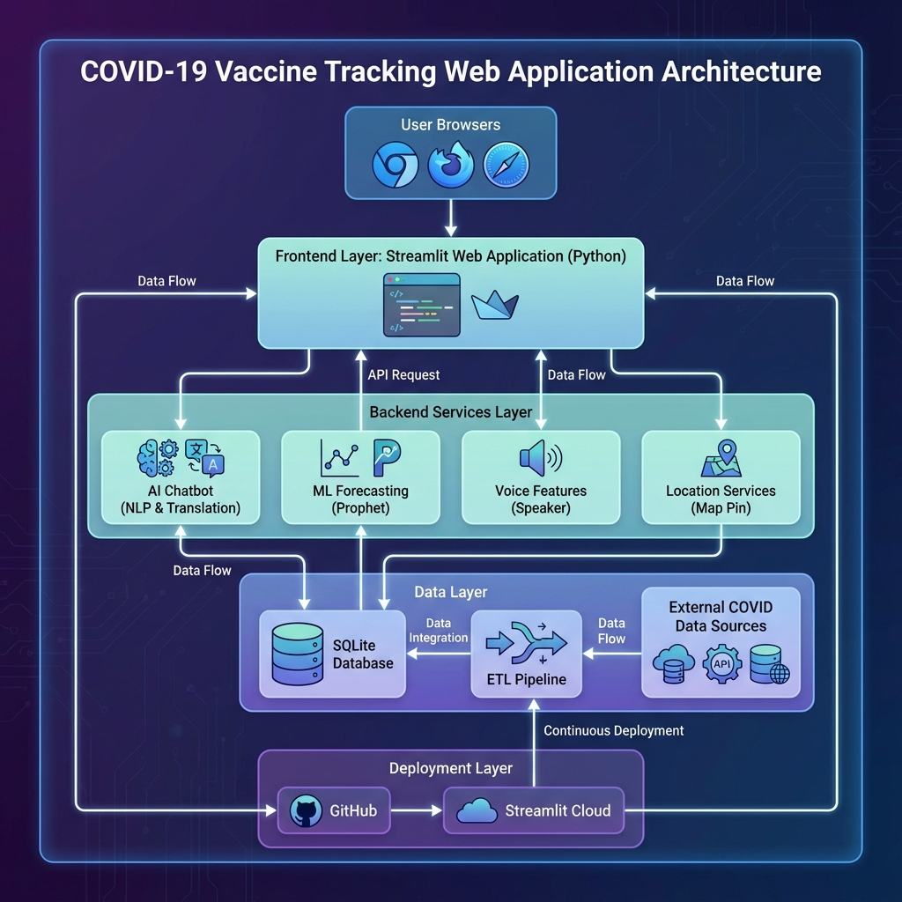

# 🌍 COVID-19 Vaccine Tracker & AI Assistant

[](https://covid-vaccine-tracker-hifycegebbt5evg4gq48dw.streamlit.app/)
[](https://www.python.org/)
[](https://opensource.org/licenses/MIT)
[](https://github.com/psf/black)

> **A full-stack data analytics platform featuring real-time vaccination tracking, ML-based forecasting, and an accessible AI chatbot with voice interaction in 5 languages.**

---

## 🚀 Project Overview

The **COVID-19 Vaccine Tracker** is a comprehensive web application designed to democratize access to critical health data. Unlike standard dashboards, this platform integrates **Artificial Intelligence** and **Accessibility** features to serve a global audience.

It combines robust data engineering (ETL pipelines) with modern frontend technologies and machine learning to provide actionable insights and personalized health information.

### 🌟 Key Differentiators

- **🗣️ Voice-Enabled AI Chatbot**: Ask questions naturally in 5 languages (English, Hindi, Bengali, Tamil, Telugu).
- **🔮 ML Forecasting**: Predicts future vaccination trends using Facebook Prophet.
- **♿ Accessibility First**: Built-in Text-to-Speech and high-contrast visualizations.
- **📍 Smart Location Services**: Auto-detects user location for personalized data views.

---

## 🏗️ Architecture

The system follows a modern, modular architecture designed for scalability and maintainability.



### Data Flow

1. **Ingestion**: Automated ETL pipeline fetches raw data from OWID (Our World in Data).
2. **Processing**: Data is cleaned, normalized, and stored in a local SQLite database.
3. **Analysis**: Prophet models generate forecasts; Pandas handles aggregations.
4. **Presentation**: Streamlit renders the interactive UI; Plotly handles visualizations.
5. **Interaction**: NLP engine processes user queries and routes them to the appropriate response handler.

---

## 🛠️ Tech Stack

### Frontend & UI

- **Streamlit**: For rapid, interactive web application development.
- **Plotly**: For interactive, publication-quality graphs.
- **HTML/CSS/JS**: Custom components for voice and location features.

### Backend & Logic

- **Python 3.9+**: Core logic and orchestration.
- **Pandas & NumPy**: High-performance data manipulation.
- **Facebook Prophet**: Time-series forecasting.
- **TextBlob & NLTK**: Natural Language Processing for the chatbot.
- **Google Translate API**: Real-time translation services.

### Data Engineering

- **SQLite**: Lightweight, serverless database engine.
- **Automated ETL**: Custom Python scripts for data refresh.

### DevOps

- **Git & GitHub**: Version control.
- **Streamlit Cloud**: CI/CD and hosting.
- **Docker**: Containerization support (optional).

---

## ✨ Key Features

### 1. 📊 Interactive Dashboard

- Global and country-specific vaccination metrics.
- Interactive choropleth maps and time-series charts.
- "Top Performing Countries" analysis.

### 2. 🤖 AI Health Assistant

- **Multi-Language**: Fluent in 5 major languages.
- **Voice Output**: Reads responses aloud for accessibility.
- **Context Aware**: Understands health queries and provides empathetic responses.

### 3. 🔮 Predictive Analytics

- Forecasts vaccination coverage for the next 30 days.
- Visualizes trends and potential plateaus.

### 4. 🏥 Symptom Checker

- Interactive self-assessment tool.
- Generates downloadable PDF health reports.
- Provides WHO-aligned guidance.

### 5. 📰 Live News Feed

- Real-time COVID-19 news from WHO and Google News RSS feeds.
- Displays 20-25 latest headlines with clickable links.
- Manual refresh button to fetch fresh news updates.

### 6. ⭐ User Feedback System

- Star rating widget (1-5 stars) for user satisfaction.
- Optional comment submission for detailed feedback.
- Feedback stored locally in CSV format for analytics.

---

## 🚀 Getting Started

### Prerequisites

- Python 3.9 or higher
- Git

### Installation

1. **Clone the repository**

   ```bash
   git clone https://github.com/Mmaneesh007/covid-vaccine-tracker.git
   cd covid-vaccine-tracker
   ```

2. **Create a virtual environment**

   ```bash
   python -m venv venv
   # Windows
   venv\Scripts\activate
   # macOS/Linux
   source venv/bin/activate
   ```

3. **Install dependencies**

   ```bash
   pip install -r requirements.txt
   ```

4. **Initialize the database**

   ```bash
   python src/etl.py
   ```

5. **Run the application**

   ```bash
   streamlit run app/streamlit_app.py
   ```

---

## 🧪 Running Tests

This project uses `pytest` for unit testing.

```bash
# Run all tests
pytest

# Run with coverage report
pytest --cov=src tests/
```

---

## 🔮 Future Roadmap

- [ ] **Mobile App**: Develop a React Native version for mobile.
- [ ] **Real-time Alerts**: Email/SMS notifications for vaccination slots.
- [ ] **API Endpoint**: Expose data via a RESTful API using FastAPI.
- [ ] **Community Forum**: Add a discussion board for users.

---

## 👨‍💻 Author

**Manish**  
*Full Stack Developer & Data Enthusiast*

[](https://linkedin.com/in/your-profile)
[](https://github.com/Mmaneesh007)

---

*Disclaimer: This application is for informational purposes only. Always consult a medical professional for health advice.*
