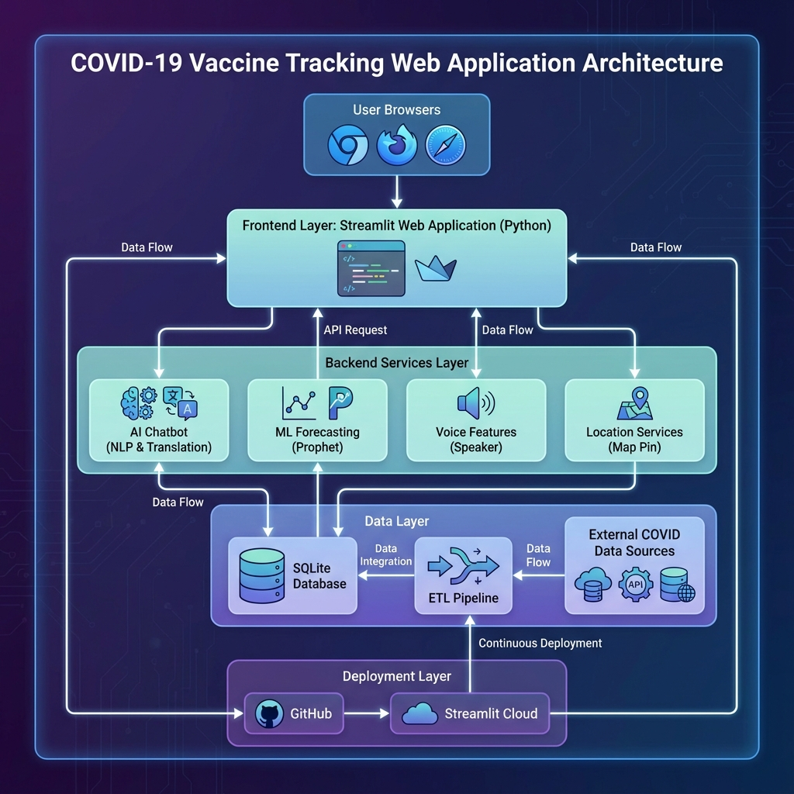

# 🌍 COVID-19 Vaccine Tracker & AI Assistant

[](https://covid-vaccine-tracker-2025.streamlit.app/)
[](https://www.python.org/)
[](https://opensource.org/licenses/MIT)
[](https://covid-vaccine-tracker-2025.streamlit.app/)
[](https://www.buymeacoffee.com/Manish_Sau)

> **A full-stack Progressive Web App (PWA) featuring real-time vaccination tracking, ML-based forecasting, viral social sharing, and an accessible AI chatbot. Installable on mobile devices with dual monetization (global + UPI).**

---

## 🚀 Project Overview

The **COVID-19 Vaccine Tracker** is a comprehensive web application designed to democratize access to critical health data. Unlike standard dashboards, this platform integrates **Artificial Intelligence** and **Accessibility** features to serve a global audience.

It combines robust data engineering (ETL pipelines) with modern frontend technologies and machine learning to provide actionable insights and personalized health information.

### 🌟 Key Differentiators

- **📱 Progressive Web App (PWA)**: Installable on Android, iOS, and Desktop with offline caching and native app experience.
- **💰 Dual Monetization**: Global donations via Buy Me a Coffee + India-specific UPI payments (GPay/PhonePe/Paytm).
- **✨ Viral Social Sharing**: Generate personalized vaccination certificates and country status cards to share on social media.
- **🌍 3D Interactive Globe**: Explore vaccination data on a rotatable 3D Earth with orthographic projection - a premium, Google Earth-style experience.
- **🤖 AI-Powered Insights**: Auto-generated natural language summaries using NLG (e.g., *"India vaccinated 1.4M today, up 15% from last week"*).
- **🗣️ Voice-Enabled AI Chatbot**: Ask questions naturally in 5 languages (English, Hindi, Bengali, Tamil, Telugu) - now with **voice input**!
- **🧠 Smart Search with TF-IDF**: Advanced NLP engine that intelligently searches eBook content for accurate answers.
- **🧪 Pandemic Simulator**: Interactive SIR model to visualize how viruses spread with real-time scenario testing.
- **⚔️ Country Face-Off**: Head-to-head comparison tool for vaccination stats between any two countries.
- **🔮 ML Forecasting**: Predicts future vaccination trends using Facebook Prophet.
- **🌌 Interactive Particle Background**: Dynamic flow field visualization that responds to mouse movements.
- **♿ Accessibility First**: Built-in Text-to-Speech and high-contrast visualizations.
- **📍 Smart Location Services**: Auto-detects user location for personalized data views.

---

## 🏗️ Full-Stack Architecture

The system is built on a modular, data-centric architecture that separates data engineering, backend logic, and frontend presentation.



### 🔄 Data Pipeline (ETL)

- **Source**: Fetches raw CSV data from *Our World in Data* (OWID) GitHub repository.

- **Transformation**: Python scripts (`src/etl.py`) clean, normalize, and impute missing values.
- **Storage**: Processed data is stored in a local **SQLite** database for fast, serverless querying.

### ⚙️ Backend Layer

- **Core Logic**: Shared Python modules (`src/`) handle forecasting (Prophet), simulation (SIR models), and NLP.

- **API Service**: An experimental **FastAPI** service (`app/experimental/`) exposes these capabilities via REST endpoints, enabling decoupled access to data and ML models.

### 🖥️ Frontend Layer

- **Streamlit Application**: The main user interface, rendering interactive **Plotly** charts and maps.

- **Client-Side Interactivity**: Custom HTML/JS components handle voice recognition (Web Speech API) and the particle background system.

### 🧠 AI & ML Engine

- **Forecasting**: Facebook Prophet models trained on historical time-series data.

- **NLP**: TF-IDF vectorization for document search and TextBlob for sentiment analysis.

---

## 🛠️ Tech Stack

### Frontend & UI

- **Streamlit**: For rapid, interactive web application development.
- **Plotly**: For interactive, publication-quality graphs.
- **HTML/CSS/JS**: Custom components for voice and location features.

### Backend & Logic

- **Python 3.9+**: Core logic and orchestration.
- **Pandas & NumPy**: High-performance data manipulation.
- **SciPy**: Mathematical modeling for SIR pandemic simulation.
- **Scikit-learn**: TF-IDF vectorization and cosine similarity for smart search.
- **Facebook Prophet**: Time-series forecasting.
- **TextBlob & NLTK**: Natural Language Processing for the chatbot.
- **Google Translate API**: Real-time translation services.

### Data Engineering

- **SQLite**: Lightweight, serverless database engine.
- **Automated ETL**: Custom Python scripts for data refresh.

### DevOps

- **Git & GitHub**: Version control.
- **Streamlit Cloud**: CI/CD and hosting.
- **Docker**: Containerization support (optional).

---

## ✨ Key Features

### 1. 📊 Interactive Dashboard

- **3D Interactive Globe** with orthographic projection for immersive data exploration.
- **AI-Generated Insights** with trend analysis and projections in natural language.
- Global and country-specific vaccination metrics.
- Dynamic time-series charts with animations.
- "Top Performing Countries" analysis.

### 2. 🤖 AI Health Assistant

- **Multi-Language**: Fluent in 5 major languages.
- **Voice Input**: Speak your questions using browser-native speech recognition.
- **Voice Output**: Reads responses aloud for accessibility.
- **Smart Search**: TF-IDF-powered engine searches eBook content for accurate answers.
- **Context Aware**: Understands health queries and provides empathetic responses.

### 3. 🔮 Predictive Analytics

- Forecasts vaccination coverage for the next 30 days.
- Visualizes trends and potential plateaus.

### 4. 🏥 Symptom Checker

- Interactive self-assessment tool.
- Generates downloadable PDF health reports.
- Provides WHO-aligned guidance.

### 5. 📰 Live News Feed

- Real-time COVID-19 news from WHO and Google News RSS feeds.
- Displays 20-25 latest headlines with clickable links.
- Manual refresh button to fetch fresh news updates.

### 6. 🌌 Interactive Particle Background

- Custom HTML5 Canvas implementation with flow field algorithm.
- 150 responsive particles that react to mouse/touch input.
- Optimized for performance with minimal impact on UX.
- Subtle beige color scheme for readability.

### 7. ⭐ User Feedback System

- Star rating widget (1-5 stars) for user satisfaction.
- Optional comment submission for detailed feedback.
- Feedback stored locally in CSV format for analytics.

### 8. 🧪 Pandemic Simulator

- **Interactive SIR Model**: Visualize how diseases spread through populations.
- **Preset Scenarios**: Quick-start with scenarios like "Strong Prevention" or "High Vaccination".
- **Real-time Updates**: Adjust contagiousness and recovery rates to see instant results.
- **Educational**: Learn about outbreak dynamics, R₀, and "flattening the curve".

### 9. ⚔️ Country Face-Off

- **Head-to-Head Comparison**: Compare vaccination performance between any two countries.
- **Battle Cards**: Side-by-side metrics including total doses, coverage %, and daily speed.
- **Trend Visualization**: Historical comparison charts showing who's winning the race.
- **Smart Insights**: Automatically highlights the better performer for each metric.

---

## 🔌 API Documentation

The project includes an experimental **FastAPI** backend that exposes vaccination data and AI features programmatically.

### Base URL

`http://localhost:8000/api/v1`

### Key Endpoints

| Method | Endpoint | Description |
| :--- | :--- | :--- |
| `GET` | `/countries` | List all available countries |
| `GET` | `/countries/{name}` | Get latest stats for a specific country |
| `GET` | `/forecast/{name}` | Get ML-generated vaccination forecast |
| `POST` | `/chat` | Send a message to the AI Health Assistant |

> **Note**: For full documentation, run the API and visit the Swagger UI at `http://localhost:8000/docs`.
> See [app/experimental/README.md](app/experimental/README.md) for detailed setup instructions.

---

## 🚀 Getting Started

### Prerequisites

- Python 3.9 or higher
- Git

### Installation

1. **Clone the repository**

   ```bash
   git clone https://github.com/Mmaneesh007/covid-vaccine-tracker.git
   cd covid-vaccine-tracker
   ```

2. **Create a virtual environment**

   ```bash
   python -m venv venv
   # Windows
   venv\Scripts\activate
   # macOS/Linux
   source venv/bin/activate
   ```

3. **Install dependencies**

   ```bash
   pip install -r requirements.txt
   ```

4. **Initialize the database**

   ```bash
   python src/etl.py
   ```

5. **Run the application**

   ```bash
   streamlit run app/streamlit_app.py
   ```

---

## 🧪 Running Tests

This project uses `pytest` for unit testing.

```bash
# Run all tests
pytest

# Run with coverage report
pytest --cov=src tests/
```

---

## 💰 Support This Project

If you find this app useful, consider supporting its development:

- ☕ **Global**: [Buy Me a Coffee](https://www.buymeacoffee.com/Manish_Sau) (Cards/PayPal via Stripe)
- 💳 **India**: UPI Payment (Click "Pay via UPI" button in the app sidebar)

---

## 🔮 Future Roadmap

- [x] **Progressive Web App**: Installable mobile app with offline support.
- [x] **Social Sharing**: Viral vaccination certificates and country cards.
- [x] **Monetization**: Dual payment options (global + UPI).
- [ ] **Real-time Alerts**: Email/SMS notifications for vaccination slots.
- [x] **API Endpoint**: Expose data via a RESTful API using FastAPI.
- [ ] **Community Forum**: Add a discussion board for users.

---

## 👨‍💻 Author

**Manish**  
*Full Stack Developer & Data Enthusiast*

[](https://linkedin.com/in/your-profile)
[](https://github.com/Mmaneesh007)

---

*Disclaimer: This application is for informational purposes only. Always consult a medical professional for health advice.*
